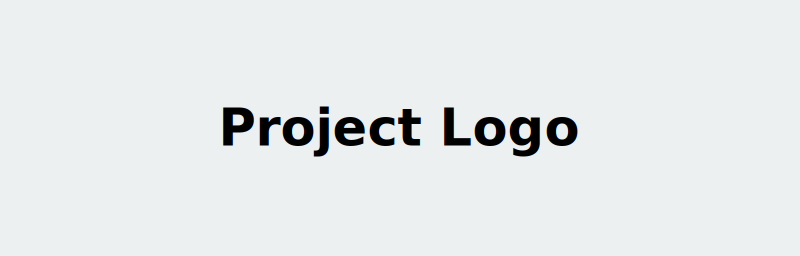
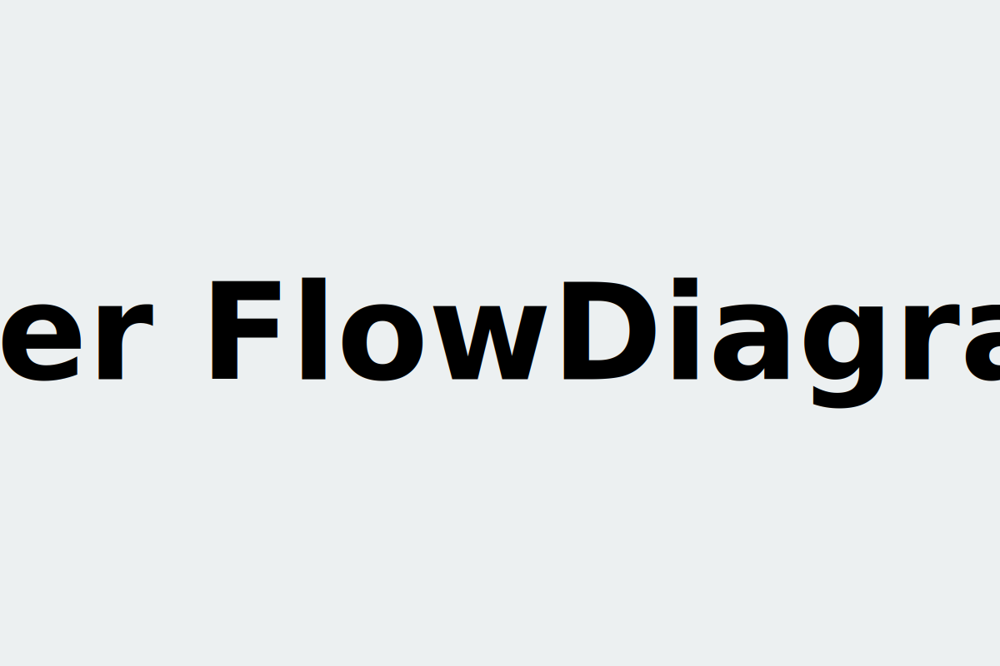

---
hide:
  - navigation
  - toc
---

<div class="hero" markdown>
<div class="hero-content" markdown>

<picture>
  <source media="(prefers-color-scheme: dark)" srcset="assets/branding/logo-dark.svg">
  <source media="(prefers-color-scheme: light)" srcset="assets/branding/logo-light.svg">
  
</picture>

# template-python

**An opinionated, production-ready Apache 2.0 template repository for bootstrapping modern software projects.**

[Get Started](getting-started/index.md){ .md-button .md-button--primary }
<a href="https://github.com/markurtz/template-python" class="md-button">View on GitHub</a>

</div>
</div>

## Overview

<p align="center">
  <picture>
    <source media="(prefers-color-scheme: dark)" srcset="assets/branding/user-flow-dark.svg">
    <source media="(prefers-color-scheme: light)" srcset="assets/branding/user-flow-light.svg">
    
  </picture>
</p>

## What's Included

<div class="grid cards" markdown>

<div class="card" markdown>
:material-rocket-launch-outline: **Getting Started**

______________________________________________________________________

Installation guide, quick start tutorial, and common workflow walkthroughs.

[:octicons-arrow-right-24: Get Started](getting-started/index.md)

</div>

<div class="card" markdown>
:material-book-open-outline: **Guides**

______________________________________________________________________

Step-by-step guides for common tasks, integrations, and configuration patterns.

[:octicons-arrow-right-24: Browse Guides](guides/index.md)

</div>

<div class="card" markdown>
:material-code-braces: **Examples**

______________________________________________________________________

Runnable code examples that demonstrate real-world usage of template-python.

[:octicons-arrow-right-24: See Examples](examples/index.md)

</div>

<div class="card" markdown>
:material-file-document-outline: **Reference**

______________________________________________________________________

Full API reference and configuration schema.

[:octicons-arrow-right-24: View Reference](reference/index.md)

</div>

<div class="card" markdown>
:material-account-group-outline: **Community**

______________________________________________________________________

Contributing guide, developer setup, Code of Conduct, and support resources.

[:octicons-arrow-right-24: Get Involved](community/index.md)

</div>

<div class="card" markdown>
:material-shield-lock-outline: **Security**

______________________________________________________________________

Our security policy, responsible disclosure process, and supported versions.

[:octicons-arrow-right-24: Security Policy](community/security.md)

</div>

</div>

## Quick Install

```bash
pip install template-python
```

For advanced installation options, and step-by-step onboarding, see the [Installation Guide](getting-started/installation.md).

## Links

- :material-github: <a href="https://github.com/markurtz/template-python">GitHub Repository</a>
- :material-map-marker-path: <a href="https://github.com/markurtz/template-python/milestones">Roadmap</a>

<!-- - :material-post-outline: <a href="{{ blog_url }}">Blog</a> -->

<!-- - :material-slack: <a href="{{ slack_url }}">Slack Community</a> -->
